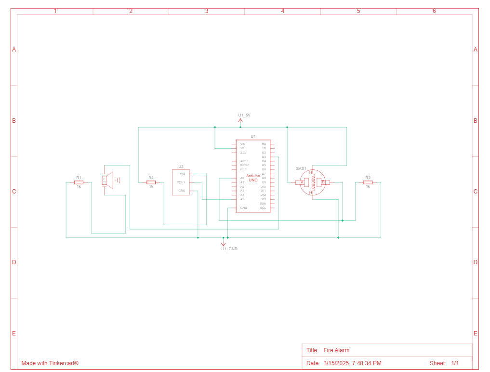

# Fire Alarm Project
## Description
This is a project for learning code arduino. 

## How's it work? 
The buzzer will play the sound if the temperature too high and having some smoke.

## Project link
Tinkercad: https://www.tinkercad.com/things/0Hao2ehee6I/editel?returnTo=%2Fdashboard%2Fdesigns%2Fcircuits

## Social post
https://x.com/ArduinoP60991/status/1900891954826932600

## Component List

## Schematic View

## Circuit

